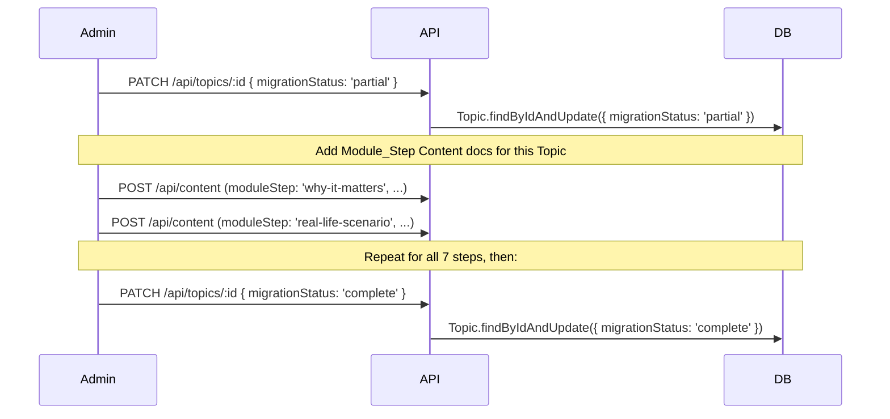

# Design Document — Learning Architecture Restructure

## Overview

This document describes the technical design for transforming Samvidhan Sarthi from a content-delivery model (Topic → Long Lesson → Quiz) into an experiential learning architecture. Every topic will follow a structured seven-step module flow:

**Why It Matters → Real-Life Scenario → Constitutional Concept → Case Example → Interactive Assessment → Reinforcement Activity → Key Takeaways**

The design is entirely backward-compatible. All existing MongoDB documents, API routes, frontend components, games, and badges continue to work throughout and after the rollout. New capabilities are layered on top through optional schema fields and a `migrationStatus` flag on the Topic model that controls the render path in `TopicDetail.js`.

### Design Objectives

1. Preserve every existing API contract, URL path, and React component prop interface.
2. Introduce the seven-step module structure using only additive schema changes.
3. Deliver richer engagement through an upgraded quiz engine, scenario system, pre/post-test framework, badge system, learning analytics, and a Know Your Rights assistant.
4. Enable gradual per-topic migration controlled by a single `migrationStatus` flag.

---

## Architecture

### System Overview

```mermaid
graph TD
    subgraph Frontend [React SPA — client/]
        A[App.js Router] --> B[TopicDetail.js]
        A --> C[ContentDetail.js]
        A --> D[Dashboard.js]
        A --> E[RightsAssistantPage NEW]
        A --> F[PreTestPage NEW]
        B --> G{migrationStatus?}
        G -- legacy --> H[Flat Content List]
        G -- partial / complete --> I[ModuleStepNavigator NEW]
        I --> J[ModuleStepCard NEW]
        J --> K[ReinforcementActivityWrapper NEW]
        K --> L[Existing Game Components]
    end

    subgraph Backend [Express API — server/]
        M[index.js] --> N[/api/content]
        M --> O[/api/progress]
        M --> P[/api/users/dashboard]
        M --> Q[/api/rights-assistant NEW]
        M --> R[/api/pre-test NEW]
        N --> S[content.js route]
        O --> T[progress.js route]
    end

    subgraph Database [MongoDB via Mongoose]
        U[Topic] --> V[+migrationStatus]
        W[Content] --> X[+moduleStep +plainLanguageValidated +questionType]
        Y[Progress] --> Z[+scenarioPerformanceScore +completedAt]
        AA[User] --> AB[+learningStreak +lastActivityDate]
        AC[Assessment existing]
        AD[Badge] --> AE[+new badge documents]
        AF[RightsQuery NEW]
    end

    Frontend <-->|HTTP + JWT| Backend
    Backend <-->|Mongoose| Database
```

### Render-Mode Selection Strategy

The `migrationStatus` field on the Topic model is the **single authoritative switch** controlling which UI path `TopicDetail.js` uses:

| `migrationStatus` | Render path |
|---|---|
| `legacy` | Existing flat `<ContentList>` — no Module_Step UI rendered |
| `partial` | `<ModuleStepNavigator>` — Module_Step docs rendered in canonical order; legacy docs appended as a flat list below |
| `complete` | `<ModuleStepNavigator>` — only Module_Step docs; full step gating enforced |

No new URL routes are added to `App.js` for individual Module_Steps. All step navigation happens **within** the existing `/topics/:topicId` page.

### Incremental Rollout Flow



---

## Components and Interfaces

### New Frontend Components

#### `ModuleStepNavigator`
- **Location**: `client/src/components/ModuleStepNavigator.js`
- **Renders inside**: `TopicDetail.js` when `migrationStatus` is `partial` or `complete`
- **Props**: `topicId: string`, `steps: ContentDocument[]`, `progress: ProgressDocument`
- **Responsibilities**: Displays steps in canonical order, enforces step gating via `canProceedToStep(stepIndex, progress)`, tracks visual completion state per step

#### `ModuleStepCard`
- **Location**: `client/src/components/ModuleStepCard.js`
- **Props**: `step: ContentDocument | null`, `stepName: string`, `isLocked: boolean`, `isCompleted: boolean`, `onComplete: (stepId) => void`
- **Responsibilities**: Renders step content using the existing `<ReactMarkdown>` pipeline; shows "Coming soon" placeholder card when `step` is null (non-priority topics)

#### `ReinforcementActivityWrapper`
- **Location**: `client/src/components/ReinforcementActivityWrapper.js`
- **Props**: `topicId: string`, `gameConfig: object`, `contentId: string`
- **Responsibilities**: Renders the appropriate existing game component (`MatchingGame`, `QuizGame`, `ScenarioGame`, `SpiralGame`, or `TimelineGame`) based on `gameConfig.type`; renders a "Return to Module" button that calls `navigate('/topics/:topicId')` — the button is owned by this wrapper, **not** by the game component, preserving existing game prop interfaces

#### `ScenarioViewer`
- **Location**: `client/src/components/ScenarioViewer.js`
- **Props**: `scenarios: ScenarioObject[]`, `onComplete: (interactions: ScenarioInteraction[]) => void`
- **Responsibilities**: Displays scenario situation text and 2–4 option buttons; on option selection, renders `constitutionalExplanation` and `learningOutcome` inline without navigation; tracks `isFirstAttempt` per scenario per session

#### `PreTestPage` / `PostTestPage`
- **Location**: `client/src/pages/PreTestPage.js`
- **Route**: `/pre-test` (added to `App.js`)
- **Responsibilities**: Renders 10 application-type questions from the Assessment question bank; on submission POSTs to `/api/pre-test/submit`; redirects to original destination on completion

#### `RightsAssistantPage`
- **Location**: `client/src/pages/RightsAssistantPage.js`
- **Route**: `/rights-assistant` (added to `App.js`)
- **Responsibilities**: Text input for constitutional rights questions; on submit, calls `GET /api/rights-assistant?q=...`; displays matched topics as links; always shows the legal disclaimer; validates that input is non-empty before calling the server

### Modified Frontend Components

#### `TopicDetail.js` (modified)
- Import `ModuleStepNavigator` 
- After fetching topic + content, branch on `topic.migrationStatus`: `legacy` → existing render path (unchanged); `partial` | `complete` → render `<ModuleStepNavigator>`
- Fetch `topicMastery` from dashboard endpoint and display it alongside the existing `completionPercentage` bar

#### `Topics.js` (modified)
- After rendering each topic card, conditionally render a `<span className="featured-label">Featured</span>` sibling element when the topic's `title` case-insensitively matches a Priority_Topic name. No changes to the topic card component's props.

### New Backend Routes

#### `/api/rights-assistant` (GET)
- **Handler file**: `server/routes/rightsAssistant.js`
- **Query param**: `q` (string, max 500 chars)
- **Logic**: Tokenise query (split on whitespace/punctuation, keep tokens ≥ 4 chars); query `Topic.find({ $or: [{ title: regex }, { description: regex }] })`; return up to 5 matching topics; always include disclaimer text; store `RightsQuery` document
- **No external API calls**

#### `/api/pre-test` (GET — fetch questions; POST `/submit` — submit answers)
- **Handler file**: `server/routes/preTest.js`
- **GET**: Returns 10 questions from the `PreTestQuestion` embedded documents or a dedicated collection; all `questionType: 'application'`
- **POST /submit**: Validates answers, calculates `preTestScore` (0–10), creates/updates `Assessment` document

#### `/api/topics/:id` (PATCH — add to existing `topics.js` route)
- Accept `{ migrationStatus }` body; validate allowed values; validate allowed transitions; update Topic document

#### Additions to existing `/api/content/track` (POST)
- After recording quiz/activity, check if this is a Module_Step completion:
  - Update `learningStreak` / `lastActivityDate` on User
  - If all 7 steps for the topic are now complete, set `completedAt` on Progress and `completionPercentage: 100`
  - If Priority_Topic and mastery ≥ 80%, run additive badge evaluation and include `newBadges` in response

#### Additions to existing `/api/users/dashboard` (GET)
- Add `topicMastery` to each entry in the `progress` array
- Add `analyticsData` key with the six sub-fields

### Validation Middleware

A shared `validateContent` middleware function handles all Content save-time validations:
1. **Word count** for `constitutional-concept` steps (> 800 → 422)
2. **Reading time** calculation and write to `estimatedTime` (formula: `Math.ceil(wordCount / 200)`)
3. **Plain language** suppression check for `plainLanguageValidated: true` documents
4. **Priority_Topic scenario** citizen-role inclusion check
5. **Priority_Topic case-example** landmark case name check
6. **Quiz ratio** validation (≥ 5 questions, ≥ 70% application)
7. **Priority_Topic publishability** (all 7 steps present with ≥ 50 chars)

---

## Data Models

### Content (extended — additive only)

```javascript
// Additions to existing contentSchema in server/models/Content.js
{
  // NEW — one of seven Module_Step identifiers; undefined on legacy docs
  moduleStep: {
    type: String,
    enum: [
      'why-it-matters',
      'real-life-scenario',
      'constitutional-concept',
      'case-example',
      'interactive-assessment',
      'reinforcement-activity',
      'key-takeaways'
    ],
    default: undefined   // absent on legacy documents; validated if present
  },

  // NEW — marks content as validated for plain language
  plainLanguageValidated: {
    type: Boolean,
    default: false
  },

  // quiz.questions[] element additions (inline to existing array schema)
  // quiz.questions[].questionType:
  //   String, enum: ['recall', 'application'], default: 'recall'

  // gameConfig additions (stored inside Mixed field — no schema change needed)
  // gameConfig.scenarios: ScenarioObject[]  (see Scenario model below)
  // gameConfig.learningObjective: String (max 200 chars, required for reinforcement-activity)
}
```

**Canonical Module_Step order** (used for sorting/gating):

```javascript
const MODULE_STEP_ORDER = [
  'why-it-matters',        // 0
  'real-life-scenario',    // 1
  'constitutional-concept',// 2
  'case-example',          // 3
  'interactive-assessment',// 4
  'reinforcement-activity',// 5
  'key-takeaways'          // 6
];
```

### Topic (extended — additive only)

```javascript
// Addition to existing topicSchema in server/models/Topic.js
{
  migrationStatus: {
    type: String,
    enum: ['legacy', 'partial', 'complete'],
    default: 'legacy'
  }
}
```

### Progress (extended — additive only)

```javascript
// Additions to existing progressSchema in server/models/Progress.js
{
  // Per-topic scenario performance: (first-attempt-correct / total) * 100
  scenarioPerformanceScore: {
    type: Number,
    min: 0,
    max: 100,
    default: null
  },

  // Set when the seventh Module_Step is completed
  completedAt: {
    type: Date,
    default: null
  },

  // Extended quizScores array element (inline — backward-compatible):
  // quizScores[].stepType: String (optional, 'module-assessment' for new entries)

  // Extended activities array elements (inline — backward-compatible):
  // activities[].activityType: String (optional, e.g. 'scenario', 'game')
  // activities[].scenarioIndex: Number (optional)
  // activities[].chosenOptionIndex: Number (optional)
  // activities[].isCorrect: Boolean (optional)
  // activities[].isFirstAttempt: Boolean (optional)
  // activities[].completedAt: Date (optional)
}
```

### User (extended — additive only)

```javascript
// Additions to existing userSchema in server/models/User.js
{
  learningStreak: {
    type: Number,
    default: 0
  },
  lastActivityDate: {
    type: Date,
    default: null
  }
}
```

### Assessment (formalised — currently defined as a plain object comment in Assessment.js)

```javascript
// server/models/Assessment.js — formalise as a Mongoose model
const assessmentSchema = new mongoose.Schema({
  userId: {
    type: mongoose.Schema.Types.ObjectId,
    ref: 'User',
    required: true,
    unique: true
  },
  preTestScore:     { type: Number, min: 0, max: 10, default: null },
  postTestScore:    { type: Number, min: 0, max: 10, default: null },
  completedPreTest: { type: Boolean, default: false },
  completedPostTest:{ type: Boolean, default: false },
  improvement:      { type: Number, default: null }, // one decimal, e.g. 42.5
  createdAt:        { type: Date, default: Date.now }
});
```

### RightsQuery (new collection)

```javascript
// server/models/RightsQuery.js
const rightsQuerySchema = new mongoose.Schema({
  userId: {
    type: mongoose.Schema.Types.ObjectId,
    ref: 'User',
    default: null
  },
  queryText: {
    type: String,
    required: true,
    maxlength: 500
  },
  matchedTopicIds: [{
    type: mongoose.Schema.Types.ObjectId,
    ref: 'Topic'
  }],
  createdAt: { type: Date, default: Date.now }
});
```

### Scenario Object (embedded in `gameConfig.scenarios`)

```javascript
// Shape stored inside Content.gameConfig.scenarios[]
// Backward-compatible with existing ScenarioGame component data format
{
  situation:    String,       // required — the scenario description
  options: [{
    text:                    String,  // required
    isCorrect:               Boolean, // required
    constitutionalExplanation: String // required
  }],
  learningOutcome: String     // required
}
```

---

## Correctness Properties

*A property is a characteristic or behavior that should hold true across all valid executions of a system — essentially, a formal statement about what the system should do. Properties serve as the bridge between human-readable specifications and machine-verifiable correctness guarantees.*

### Property 1: Module_Step Enum Round-Trip

*For any* valid `moduleStep` enum value, a Content document created with that value and then retrieved from the database should contain the identical `moduleStep` value.

**Validates: Requirements 1.5**

---

### Property 2: Step Order Invariant

*For any* Topic whose `migrationStatus` is `complete` or `partial`, the Content documents returned by the API sorted by their `order` field should have their `moduleStep` values appear in the canonical sequence (`why-it-matters` before `real-life-scenario` before … before `key-takeaways`).

**Validates: Requirements 1.2, 12.1**

---

### Property 3: Step Gating Logic

*For any* Module_Step type and any learner Progress state, the `canProceedToStep(stepIndex, progress)` function should return `false` if and only if the preceding step's completion condition has not been met (passive steps: acknowledged; Interactive Assessment: submitted; Reinforcement Activity: at least one game or scenario interaction recorded).

**Validates: Requirements 1.3**

---

### Property 4: Priority_Topic Publishability Guard

*For any* Priority_Topic and any subset of its seven Module_Step Content documents where at least one step is absent or has a `content` field shorter than 50 characters, the publishability check endpoint should return HTTP 422 with a response body listing the names of the incomplete steps.

**Validates: Requirements 1.6, 11.6**

---

### Property 5: Reading Time Calculation

*For any* Content document saved with a non-empty `content` string, the stored `estimatedTime` field should equal `Math.ceil(wordCount / 200)` where `wordCount` is the count of whitespace/punctuation-delimited tokens in the `content` string.

**Validates: Requirements 2.4**

---

### Property 6: Plain Language Suppression

*For any* Content document with `plainLanguageValidated: true` whose `content` field contains at least one of the five forbidden phrases (case-insensitive), the display pipeline should suppress rendering and return an author warning.

**Validates: Requirements 2.2**

---

### Property 7: Constitutional Concept Word Limit

*For any* Content document with `moduleStep: 'constitutional-concept'` whose `content` field contains more than 800 words, a save attempt should return HTTP 422 with the message "Content exceeds 800-word limit".

**Validates: Requirements 2.3**

---

### Property 8: Priority_Topic Scenario Citizen-Role Validation

*For any* Priority_Topic `real-life-scenario` Content document whose `content` field contains at least one word from the exclusion list (`minister`, `politician`, `judge`, `advocate`, `lawyer`, `official`, `bureaucrat`) and no word from the inclusion list (`student`, `teacher`, `farmer`, `worker`, `voter`, `resident`, `citizen`, `family`, `parent`, `child`), a save attempt should return HTTP 422 indicating the scenario must feature an ordinary citizen.

**Validates: Requirements 2.5**

---

### Property 9: Quiz Application Ratio Validation

*For any* quiz Content document with fewer than 5 questions or with a ratio of `application`-type questions below 70%, a create/update attempt should return HTTP 422 identifying which condition failed.

**Validates: Requirements 3.2**

---

### Property 10: Assessment Score Recording

*For any* Interactive Assessment submission, the Progress document fetched immediately after should contain a `quizScores[]` entry with the submitted `score` value and `stepType: 'module-assessment'`.

**Validates: Requirements 3.5**

---

### Property 11: Low Score Review Prompt Threshold

*For any* quiz score value `s`, the review prompt (offering links to `constitutional-concept` and `case-example` steps plus a retake button) should be visible if and only if `s < 60`.

**Validates: Requirements 3.6**

---

### Property 12: Scenario Data Round-Trip

*For any* valid Scenario object array stored in `gameConfig.scenarios` of a Content document, fetching that document should return a `gameConfig.scenarios` array whose objects contain identical `situation`, `options`, and `learningOutcome` values.

**Validates: Requirements 4.1, 4.3**

---

### Property 13: Scenario Interaction Tracking Completeness

*For any* scenario interaction event, the Progress document fetched after should contain an `activities[]` entry with all six required fields populated: `activityType: 'scenario'`, `contentId`, `scenarioIndex`, `chosenOptionIndex`, `isCorrect`, `isFirstAttempt`, `completedAt`.

**Validates: Requirements 4.5**

---

### Property 14: Scenario Performance Score Formula

*For any* set of scenario interactions associated with a Topic, where `C` is the count of interactions where `isFirstAttempt && isCorrect` and `T` is the total scenario count, the stored `scenarioPerformanceScore` should equal `Math.round((C / T) * 100)`.

**Validates: Requirements 4.6**

---

### Property 15: Schema Backward Compatibility

*For any* existing Content, Topic, or User document that lacks the new optional fields, fetching it via any existing API endpoint should return HTTP 200 with all pre-existing fields intact and no Mongoose validation error.

**Validates: Requirements 5.1, 5.3**

---

### Property 16: Migration Script Preserves Document Count and IDs

*For any* batch of Content documents without a `moduleStep` field, running the migration script (`$set: { moduleStep: null }`) should produce a post-migration Content collection with the same document count and with every pre-existing `_id` value still present and all other field values unchanged.

**Validates: Requirements 5.6, 12.6**

---

### Property 17: Render-Mode Selection by migrationStatus

*For any* Topic with a given `migrationStatus` value, the `TopicDetail.js` render-mode selector function should return `'module-step-ui'` for `partial` or `complete`, and `'flat-list'` for `legacy`.

**Validates: Requirements 5.5, 12.1, 12.5**

---

### Property 18: Pre-Test Redirect Guard

*For any* authenticated route navigation event (excluding `/pre-test`, `/login`, `/register`) by a user whose Assessment document has `completedPreTest: false`, the navigation interceptor should redirect to `/pre-test`.

**Validates: Requirements 6.1, 6.6**

---

### Property 19: Improvement Formula

*For any* pair `(preTestScore > 0, postTestScore)` where both are integers 0–10, the stored `improvement` value after Post_Test submission should equal `Math.round(((postTestScore - preTestScore) / preTestScore) * 1000) / 10`.

**Validates: Requirements 6.4**

---

### Property 20: Post-Test Banner Threshold

*For any* learner state, the Post_Test completion banner on the Dashboard should be visible if and only if `topicsCompleted >= 5 && !completedPostTest`.

**Validates: Requirements 6.3**

---

### Property 21: Topic Mastery Formula

*For any* triple `(quizScore, scenarioPerformanceScore, gameScore)` where each is an integer 0–100 (defaulting to 0 if absent), `topicMastery` should equal `Math.round(quizScore * 0.5 + scenarioPerformanceScore * 0.3 + gameScore * 0.2)`.

**Validates: Requirements 8.1**

---

### Property 22: Learning Streak Arithmetic

*For any* pair `(lastActivityDate, completionDate)` expressed as UTC calendar dates, the streak update logic should: increment `learningStreak` by 1 and set `lastActivityDate` to `completionDate` when the UTC day difference is exactly 1; set `learningStreak` to 1 and update `lastActivityDate` when the difference is greater than 1.

**Validates: Requirements 8.4, 8.5**

---

### Property 23: Badge Award Logic

*For any* learner state (set of Progress records, Assessment document, User document), the badge evaluation function should award exactly the set of badges whose threshold conditions are all satisfied by that learner state, and should award no badge whose threshold is not fully satisfied.

**Validates: Requirements 7.1, 7.3, 11.4**

---

### Property 24: Badge Seed Idempotence

*For any* number of seed script executions ≥ 1, the total count of Badge documents in the collection after `N` runs should equal the count after 1 run (i.e., no duplicate badge names are inserted).

**Validates: Requirements 7.6**

---

### Property 25: KYR Keyword Matching Correctness

*For any* query string and any set of Topic documents, the KYR matching function should return only Topics that share at least one token of ≥ 4 characters (case-insensitive) with the query, and the result count should be ≤ 5.

**Validates: Requirements 10.2**

---

### Property 26: KYR Disclaimer Invariant

*For any* KYR query (whether it produces matches or not), the response payload should always contain the full disclaimer string.

**Validates: Requirements 10.3**

---

### Property 27: Empty KYR Query Validation

*For any* string composed entirely of whitespace characters (or empty string), the KYR input handler should not invoke the server-side matching endpoint and should display the inline validation message "Please enter a question".

**Validates: Requirements 10.7**

---

### Property 28: Priority_Topic Classification

*For any* topic title string, the `isPriorityTopic(title)` function should return `true` if and only if the title (case-insensitively) exactly matches one of the ten canonical Priority_Topic values.

**Validates: Requirements 11.1**

---

### Property 29: Priority_Topic Case Example Landmark Validation

*For any* Content document with `moduleStep: 'case-example'` belonging to a Priority_Topic, a save attempt should succeed only if the `content` field contains at least one verbatim (case-sensitive) occurrence of a landmark case name from the list: "Kesavananda Bharati", "Maneka Gandhi", "Vishaka", "S.R. Bommai", "Indra Sawhney", "Minerva Mills".

**Validates: Requirements 11.2**

---

### Property 30: Priority_Topic Featured Label

*For any* Topics list response, each Topic whose title is a Priority_Topic should have a "Featured" label rendered in the `Topics.js` listing, and every non-Priority_Topic should not have the label.

**Validates: Requirements 11.3**

---

### Property 31: Partial Migration Ordering

*For any* Topic with `migrationStatus: 'partial'`, the content list rendered by `ModuleStepNavigator` should place Content documents with a `moduleStep` value before Content documents without one (legacy docs), with Module_Step docs sorted in canonical step order.

**Validates: Requirements 12.3**

---

### Property 32: Migration Status Transition Validity

*For any* `(from, to)` migration status pair, the Topic PATCH endpoint should return HTTP 200 for valid transitions (`legacy→partial`, `partial→complete`, `complete→partial`) and HTTP 422 for all other transitions (e.g., `legacy→complete`, `complete→legacy`).

**Validates: Requirements 12.4**

---

## Error Handling

### Validation Errors (422)

All save-time validation failures return HTTP 422 with a consistent body:

```json
{
  "error": "ValidationFailed",
  "details": ["<specific message per failed rule>"]
}
```

Examples:
- Priority_Topic publishability: `"details": ["interactive-assessment: content too short", "key-takeaways: missing"]`
- Quiz ratio: `"details": ["Quiz must have at least 5 questions", "At least 70% of questions must be application type"]`
- Word limit: `"details": ["Content exceeds 800-word limit"]`
- Citizen role: `"details": ["real-life-scenario for a Priority_Topic must feature an ordinary citizen (student, voter, etc.)"]`
- Migration transition: `"details": ["Invalid migration transition: legacy → complete"]`

### Not Found (404)

Existing 404 handling for Topic and Content is unchanged. New routes (rights-assistant, pre-test) follow the same pattern.

### Pre-Test Redirect

The redirect guard is implemented as a React context-aware wrapper (`PreTestGuard`) that wraps all protected routes in `App.js`:

```jsx
// Pseudo-code — actual implementation in PreTestGuard.js
if (!assessment?.completedPreTest && 
    !isExemptRoute(location.pathname)) {
  return <Navigate to="/pre-test" replace />;
}
```

Exempt routes: `/pre-test`, `/login`, `/register`.

### Schema Backward Compatibility

All new Mongoose fields have either `default: undefined` (omitted from document if not set) or an explicit falsy default (`false`, `0`, `null`). Mongoose validation for new fields uses `required: false` (the default). This ensures fetching any legacy document never throws a validation error.

### Streak Reset on Gap

If `lastActivityDate` is `null` (new user or first activity), streak is set to 1 and `lastActivityDate` is set to the current UTC date. This handles the initial state without branching in the main streak logic:

```javascript
// server/utils/streakUtils.js
function updateStreak(user, completionDateUtc) {
  if (!user.lastActivityDate) {
    user.learningStreak = 1;
  } else {
    const dayDiff = utcDayDiff(completionDateUtc, user.lastActivityDate);
    if (dayDiff === 1) user.learningStreak += 1;
    else if (dayDiff > 1) user.learningStreak = 1;
    // dayDiff === 0: same day, no change
  }
  user.lastActivityDate = completionDateUtc;
}
```

---

## Testing Strategy

### Dual Testing Approach

Unit tests verify specific examples and edge cases. Property-based tests verify universal correctness across large input spaces. Both are complementary.

**Property-based testing library**: [`fast-check`](https://github.com/dubzzz/fast-check) — chosen for JavaScript ecosystem fit, Mongoose model compatibility, and active maintenance.

Each property-based test runs a minimum of **100 iterations**. Each test is tagged with a comment referencing its design property:

```javascript
// Feature: learning-architecture-restructure, Property 5: Reading Time Calculation
it('estimatedTime equals ceil(wordCount / 200) for any content string', () => {
  fc.assert(
    fc.property(fc.string({ minLength: 1 }), (content) => {
      const wordCount = countWords(content);
      expect(computeEstimatedTime(content)).toBe(Math.ceil(wordCount / 200));
    }),
    { numRuns: 100 }
  );
});
```

### Unit Tests

Unit tests cover:
- Specific examples for each content type rendering
- Integration between `ModuleStepNavigator` and step gating
- Each API route happy-path and error-path with fixed payloads
- Migration script with a controlled in-memory MongoDB (using `mongodb-memory-server`)
- Badge award logic with known progress states
- Pre/Post test submission and improvement calculation with specific score pairs
- Streak calculation with specific date pairs (same day, +1 day, +3 days, null initial state)

### Property-Based Tests

One `fast-check` test per design property. Generators:

| Generator | Produces |
|---|---|
| `fc.constantFrom(...MODULE_STEP_ORDER)` | Valid moduleStep enum value |
| `fc.string({ minLength: 1 })` | Arbitrary content string for word count / validation tests |
| `fc.integer({ min: 0, max: 10 })` | Pre/Post test score |
| `fc.integer({ min: 0, max: 100 })` | Component scores for mastery formula |
| `fc.date()` | Dates for streak arithmetic |
| `fc.array(fc.record({ situation: fc.string(), ... }))` | Scenario objects |
| `fc.record({ quizScore: ..., scenarioScore: ..., gameScore: ... })` | Topic mastery input triple |
| `fc.oneof(fc.constant('legacy'), fc.constant('partial'), fc.constant('complete'))` | migrationStatus values |

### Integration Tests

- All existing API routes (`/api/auth/*`, `/api/users/*`, `/api/content/*`, `/api/progress/*`, `/api/topics/*`) tested against a test MongoDB to verify HTTP methods, URL paths, and response field shapes are preserved
- Game components (`MatchingGame`, `QuizGame`, `ScenarioGame`, `SpiralGame`, `TimelineGame`) rendered with their existing prop interfaces; no prop changes expected

### Smoke Tests

- User schema contains `learningStreak` and `lastActivityDate` fields with correct defaults
- All five game component prop type signatures match pre-migration baselines
- `/rights-assistant` route exists in `App.js` and renders without crash
- KYR matching makes no external HTTP calls (mocked network layer has zero outbound calls)
- Content seeding script for 3 Priority_Topics × 7 steps runs without `ValidationError`
